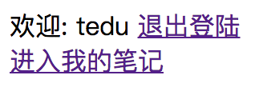
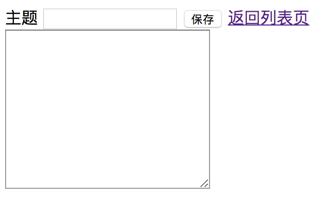
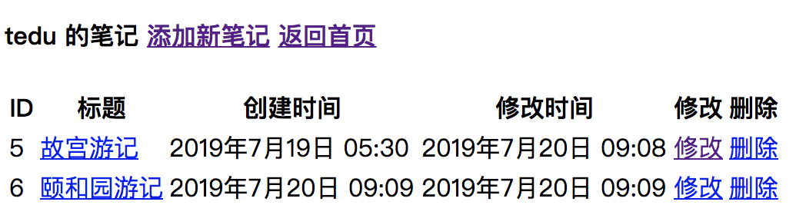
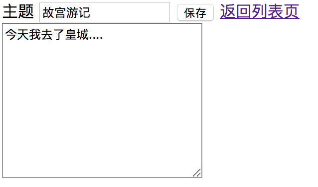

 

# 《Django 项目之网络云笔记》
## 目录
[TOC]

## 网络云笔记项目
- 功能:
    1. 注册
    1. 登陆
    1. 退出登陆
    1. 查看笔记列表
    1. 创建新笔记
    1. 修改笔记
    1. 删除笔记
### 数据库设计
- 模型类
    1. 用户模型类
        ```python
        class User(models.Model):
            username = models.CharField("用户名", max_length=30, unique=True)
            password = models.CharField("密码", max_length=32)
    		created_time = models.DateTimeField('创建时间', auto_now_add=True)
            updated_time = models.DateTimeField('更新时间', auto_now=True)
        
            def __str__(self):
                return "用户" + self.username
        ```
    2. 笔记模型类
    
    ~~~python
    from user.models import User
    
    class Note(models.Model):
        title = models.CharField('标题', max_length=100)
        content = models.TextField('内容')
        created_time = models.DateTimeField('创建时间', auto_now_add=True)
        updated_time = models.DateTimeField('更新时间', auto_now=True)
    	user = models.ForeignKey(User, on_delete=models.CASCADE)
    
    ~~~


### 设计规范
- 登陆设计规范(在user应用中写代码)
    | 路由正则 | 视图函数 | 模板位置 | 说明 |
    |-|-|-|-|
    | /user/login | login_view | templates/user/login.html | 登陆 |
    | /user/reg | reg_view | templates/user/register.html| 注册 |
    | /user/logout  | logout_view | 无 | 退出 |

    - 参考界面: 
        - 登陆界面
            - 
        - 记住用户名，当选中复选框时，希望将用户信息保存的时间更长一些，存储在cookie中，例如：默认在session存储1天，当选中复选框，存储7天，存储在cookie。
        - <QueryDict: { 'remember': ['on']}>
    - if ’remember' in request.POST:
            - **表示选中了记住用户名**
        - 注册界面
            - 
    
- 主页设计规范(在index应用中写代码)
    | 路由正则 | 视图函数 | 模板位置 | 说明 |
    |-|-|-|-|
    | /index/ | index_view | templates/index/index.html | 主页 |

    - 参考界面
        - 登陆前
            - 
        - 登陆后
            - 
    
- 云笔记设计规范
    | 路由正则 | 视图函数 | 模板位置 | 说明 |
    |-|-|-|-|
    | /note/ | list_view | templates/note/list_note.html | 显示笔记列表功能 |
    | /note/add | add_view | templates/note/add_note.html| 添加云笔记 |
    | /note/mod/(\d+)  | mod_view | templates/note/mod_note.html | 修改之前云笔记 |
    | /note/del/(\d+) | del_view | 无(返回列表页) | 删除云笔记|
    - 对笔记的任何操作（4个视图函数都需要验证） 都要登录成功后在操作？装饰器!!
        
    - 参考界面
        
        - 添加新笔记界面
          
            - 
        - 显示笔记列表
          
            - 
        - 修改云笔记
          
            - 
            
            
